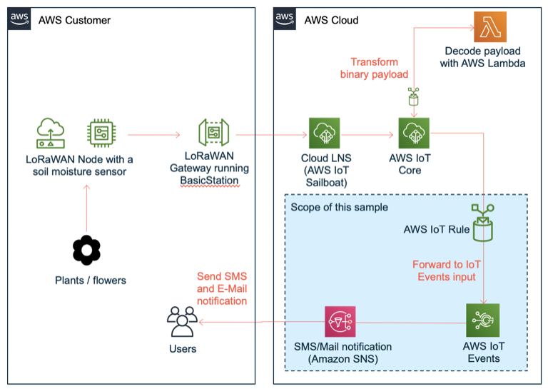
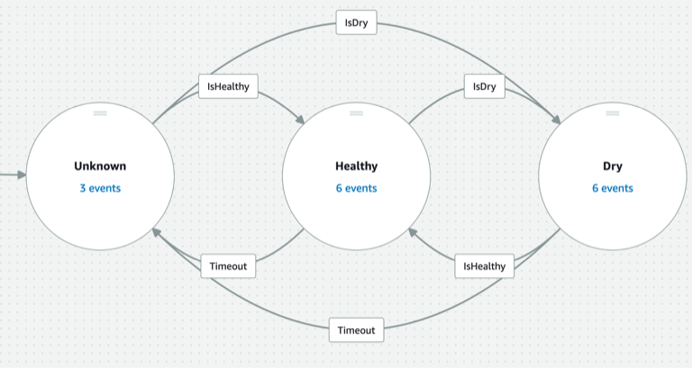

# AWS IoT Core for LoRaWAN - sample application for event detection and user alarming 
Detecting events based on telemetry data from connected devices is a common use case in IoT across many industries.

As an example, let's examine a soil moisture monitoring use case. Possible events in that use case could be "Dry moisture detected" or "Healthy moisture detected" depending on a measured soil moisture level and a pre-defined threshold. A possible action could be a notification of a user about that event per Mail and SMS, enabling the user to react to that event by watering the plants. 

One of recommended services to implement that use case is [AWS IoT Events](https://aws.amazon.com/iot-events/). It is a fully managed service that makes it easy to detect and respond to events from IoT sensors and applications.   

This repository contains a sample for integrating AWS IoT Events with LoRaWAN for IoT Core. In this example we will show how to translate telemetry values from a LoRaWAN device into events and notify users about these events using E-Mail and SMS. 


## Solution Architecture

To provide you a broader context, a following diagram provides an overview of the overall architectural setup that can be used to implement event handling from LoRaWAN devices.



This sample covers the part of architecture containing AWS IoT Rule, AWS IoT Events and Amazon SNS (blue background in the figure above). It is built under assumption that telemetry data  from LoRaWAN devices is published to an AWS IoT Core MQTT as described in the [Prerequisites](#prerequisites) section.  

By following guidelines in this a sample, you will implement the following [AWS IoT Events detector model](https://docs.aws.amazon.com/iotevents/latest/developerguide/iotevents-detector-model.html) in your AWS Account:



The detector model has 3 states:
- Dry: the measured moisture level is at or below a predefined threshold of 10%
- Healthy: the measured moisture level is above a predefined threshold of 10%
- Unknown: no measurement has been ingested since more then 1 minute

Each time a new soil moisture measurement is sent to an [AWS IoT Events detector input](https://docs.aws.amazon.com/iotevents/latest/developerguide/iotevents-detector-input.html), the detector model compares measured soil moisture value with a pre-defined threshold value (e.g. 10%):

- If the measurement is above 10%, the detector model state changes to "Healthy"
- If the measurement is at or below 10%, the detector model state changes to "Dry"  
- If no data is sent to the detector input for a predefined amount of time (currently 1 minute), the state changes to "Unknown"

On each state change between "Healthy" and "Dry" a message to an Amazon SNS topic is generated and a notification via E-Mail and SMS will be sent. The model implementation ensures that if the state changes to "Unknown", a notification is only sent when there is a change between "Dry" and "Healthy" state (e.g. "Dry" -> "Unknown" -> "Dry" will not result in notification, but "Dry" -> "Unknown" -> "Healthy" will result in a notification). Please consult [How the IoT Event detector model works](#how-the-iot-event-detector-model-works) section for details.

## Prerequisites 
For this sample to work, your LoRaWAN devices have to publish payloads to a topic `dt/lorawantransformed/moisture/<Device Id>`. These payloads must have a following JSON structure:

  ```json
  {
    "payload": {
        "transformed_payload": {
            "water_soil": 10.1,
            "DeviceId": "33a9fdf8-e7ac-406f-9517-df4807603"
        }
    }
  }
```

Additional JSON attributes are ignored. The name of the topic can be adjusted by changing the default parameter of the CloudFormation template.

If you have not implemented publishing of payloads from your LoRaWAN devices yet, please consider the following options:

- You can test this sample by simulating ingestion from your LoRaWAN devices with an [AWS IoT Test client](https://docs.aws.amazon.com/iot/latest/developerguide/view-mqtt-messages.html) as described in [this section](#option-1-test-by-ingesting-sample-payload-via-aws-iot-mqtt-test-client)
- You can use [transform a binary LoRaWAN payload into JSON sample](../integration/transform_binary_payload_custom) to learn how to use binary decoders to convert binary payloads from your LoRaWAN device into JSON and publish these payloads to above mentioned topic in above mentioned JSON structure.

## Quick setup - deploy a sample application in your AWS Account

You can use two options to deploy a sample application: a deployment using AWS Management console via AWS CloudFormation or a deployment with [AWS SAM](https://aws.amazon.com/serverless/sam/) using your command shell. If in doubt, please select the former one.  

### Deployment option 1: AWS CloudFormation
**Warning: Please contact svirida@ if access to presigned URL with CF template fails. This is a temporary workaround for confidentiality reasons.**

[Launch CloudFormation stack in us-east-1](https://console.aws.amazon.com/cloudformation/home?region=us-east-1#/stacks/create/review?stackName=soilmoisturealarming&templateURL=ttps://githubsample-aws-iot-core-lorawan-us-east-1.s3.amazonaws.com/sample_applications/soilmoisture_alarming/template/cf-template-dontedit.yaml)

Before starting a stack, please change an E-Mail and SMS to be used for alarming.

After a successful completion of stack, please continue [here](#congratulations-you-successfully-deployed-an-event-detection-and-user-alarming--application).

### Deployment option 2: AWS SAM

Please perform following steps:

1. Check out this repository on your computer

    ```shell
    # git clone https://github.com/aws-samples/aws-iotcore-lorawan , Not published yet!
    git clone ssh://git.amazon.com/pkg/Aws-iot-lorawansb-sample
    cd sample_applications/soilmoisture_alarming
    ```

2. This sample uses [AWS SAM](https://aws.amazon.com/serverless/sam/) to build and deploy all necessary resources (e.g. AWS IoT Events detector model, AWS IoT Rule, AWS IAM Roles) to your AWS account. Please perform the following commands to build the SAM artifacts:

   ```shell
   sam build
   ```

3. Deploy the SAM template to your AWS account.

   ```shell
   sam deploy --guided
   ``` 

    You can leave all parameters at default with exception of the following parameters:
    - AlarmMailParameter : E-Mail address for notifications about events
    - AlarmSMSParameter : SMS for notifications about events

  **Please note:  `sam deploy --guided` should be only executed for a first deployment or if you want to adjust paramrters of your SAM template. To redeploy with existing parameters that please run `sam deploy`.**


# Congratulations! You successfully deployed an event detection and user alarming  application

Following resources have been deployed to your AWS account:  

**1. AWS IoT Core Rule `ForwardLoRaWANTelemetryToIoTEvents`**

  This rule forwards a LoRaWAN payload to AWS IoT Events detector model. Please refer to section [Prerequisites](#prerequisites) for details on a topic name this rule subscribes to and an expected JSON payload format.


**2. AWS IoT Events detection model `SoilmoistureEventDetectionModel`**

  Please refer to section [How the IoT Event detector model works](#how-the-iot-event-detector-model-works) for details of detector model implementation

**3.AWS IoT Events input `MoistureSensorMeasurement`**
  Please refer to section [How the IoT Event detector model works](#how-the-iot-event-detector-model-works) for details of detector model implementation

**4. Amazon SNS topic `SBDemoAlarmTopic`**
  This topic is pre-configured with two subscriptions (SMS and E-Mail) according to your parameter inputs in a CloudFormation template.

## How to run the application

This section describes various options for running the application in this sample. The first options allows you to simulate an ingestion from a LoRaWAN device, whereas the second options describes integration with LoRaWAN devices.

### Option 1: test by ingesting sample payload via AWS IoT MQTT Test client

Topic name: `$aws/rules/ForwardLoRaWANTelemetryToIoTEvents/dt/lorawantransformed/moisture/12345`  

To put detector in a "Dry" state, please ingest following payload to the above mentioned topic:

```json
{
    "payload": {
        "transformed_payload": {
            "water_soil": 1,
            "DeviceId": "33a9fdf8-e7ac-406f-9517-df4807603"
        }
    }
}
```


To put detector in a "Healthy" state, please ingest following payload to the above mentioned topic:

```json
{
    "payload": {
        "transformed_payload": {
            "water_soil": 70,
            "DeviceId": "33a9fdf8-e7ac-406f-9517-df4807603"
        }
    }
}
```


After ingesting these payloads your should receive Mail / SMS with according text. You can also use AWS IoT Events console to view the status of a detector like in a picture below:


### Option 2: Connect application to your LoRaWAN devices  

To connect the application to your LoRaWAN devices, you have to ensure that the data ingested by LoRaWAN devices adheres to a following format:

```json
{
    "payload": {
        "transformed_payload": {
            "water_soil": 10.1,
            "DeviceId": "33a9fdf8-e7ac-406f-9517-df4807603"
        }
    }
  }
```

Attribute values:

- `water_soil` value is a float between 0 and 100 and reflects the relative soil moisture between 0% (dry) and 100% (full moistured).
- `DeviceId` value is a string with a maximum length of 128 which uniquely identifies the device. For example, you could use LoRaWAN DeviceId or any other unique string.

The aforementioned payload is expected to be published to an MQTT topic `dt/lorawantransformed/moisture/<DeviceId>` as defined in the AWS IoT Core Rule `ForwardLoRaWANTelemetryToIoTEvents`.

## Advanced technical information

## How the IoT Event detector model works
Before you proceed with a following explanation, you may want to review a [concept of Detector Model in AWS IoT Events documentation](https://docs.aws.amazon.com/iotevents/latest/developerguide/iotevents-getting-started.html). 

The detector model implements a user notification according to a following logic:

|State t|State t+1|Action|
|-|-|-|
|Dry|Dry|none|
|Healthy|Healthy|none|
|Healthy|Dry|Publish SNS message with alarm text|
|Dry|Healthy|Publish SNS message with "all-clear" text|  

If the model changes to "Unknown" state after lack of ingestion for a predefined amount of time (currently 1 minute), following notification logic applies:

|State t|State t+1|State t+2|Action|
|-|-|-|-|-|
|Dry|Unknown|Dry|None|
|Healthy|Unknown|Healthy|None|
|Healthy|Unknown|Dry|Publish SNS message with alarm text|
|Dry|Unknown|Healthy|Publish SNS message with "all-clear" text|

